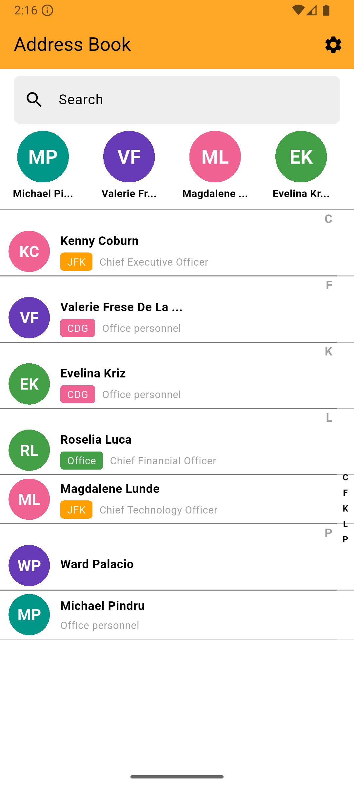
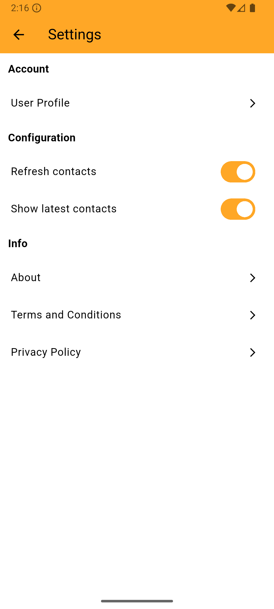

About
===

**[AppDressBook](https://github.com/davidegironi/appdressbook)** is an **Address Book app that synchronizes contacts using a custom API server**.  
It is **useful for companies or associations** that's want to share contacts using a unique application. They just have to build their own server that provides the contact list and eventually an authentication method, then the server url can be shared with people engaged and used in this app. A test api server is provided unser apiserversample folder.  
AppDressBook is Open Source and it's built using [Flutter](https://flutter.dev/).

## Download
* **[Google Play Store](https://play.google.com/store/apps/details?id=com.davidegironi.appdressbook)**
* **App Store** I don't have an Apple Developer Account, donations are welcome.

## Screenshot

## RESTful API server
The specification documents to build a **RESTful API server** that works with this application can be found in the api docs folder.  
Furthermore a sample application is available at address: https://appdressbook.onrender.com/

## Development

If you want to contribute, or you found a bug, please send an e-mail to the software author.

## License

Copyright (c) Davide Gironi, 2018.  
AppDressBook is an open source software licensed under the [GPLv3 license](http://opensource.org/licenses/GPL-3.0)